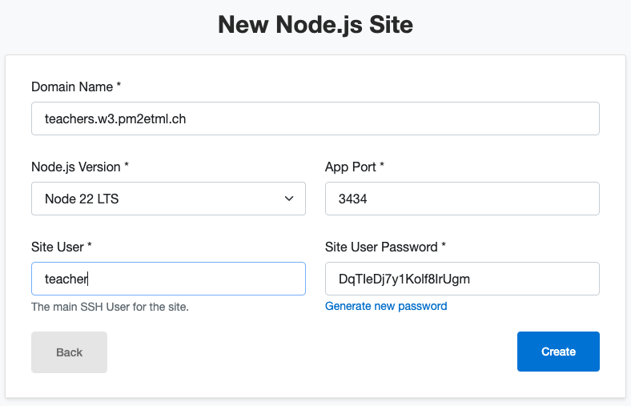
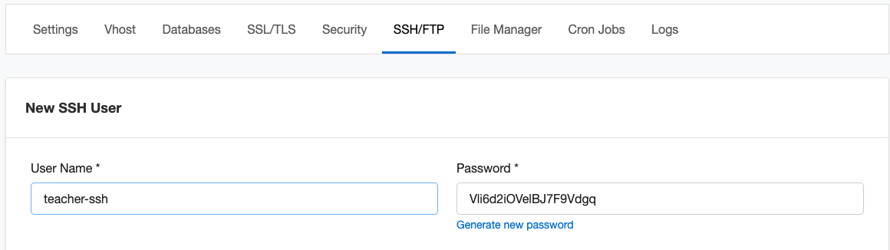
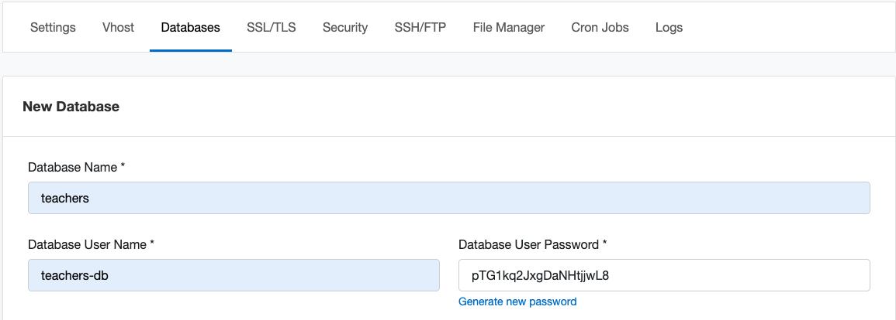
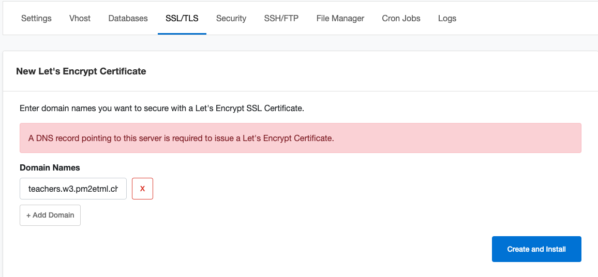
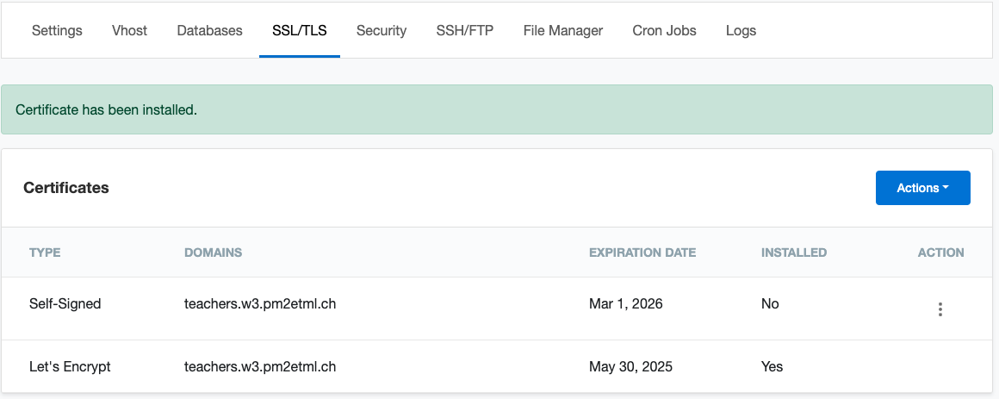
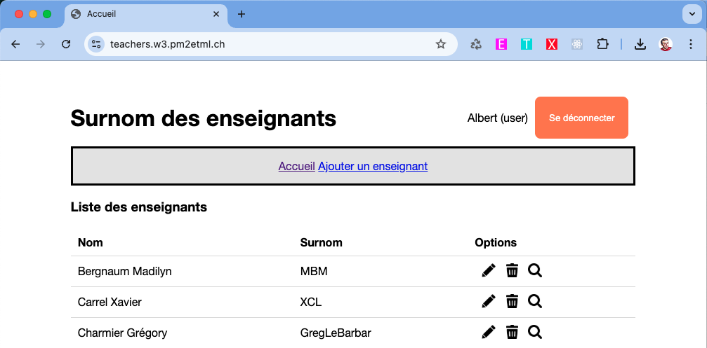

# Installation de l'application AdonisJS app-teachers sur l'infra ETML w3
_<small><small>(XCL, mars 25)</small></small>_

## Console CloudPanel







## Terminal

```
~: ssh -p 222 teacher@teachers.w3.pm2etml.ch
teacher@teachers.w3.pm2etml.ch's password: 

########################################################
###            Welcome to CloudPanel                 ###
########################################################

* Website:         https://www.cloudpanel.io
* Documentation:   https://www.cloudpanel.io/docs/v2/
* Best Practices:  https://www.cloudpanel.io/docs/v2/best-practices/
* CloudPanel:      https://admin.w3.pm2etml.ch/ 
* CloudPanel CLI:  clpctl


The programs included with the Ubuntu system are free software;
the exact distribution terms for each program are described in the
individual files in /usr/share/doc/*/copyright.

Ubuntu comes with ABSOLUTELY NO WARRANTY, to the extent permitted by
applicable law.

teacher@w3:~$ git clone https://github.com/GregLeBarbar/app-teachers-adonisjs teachers
Cloning into 'teachers'...
Username for 'https://github.com': ghp_..b4e
Password for 'https://ghp_...b4e@github.com': 
remote: Enumerating objects: 643, done.
remote: Counting objects: 100% (162/162), done.
remote: Compressing objects: 100% (134/134), done.
remote: Total 643 (delta 67), reused 97 (delta 23), pack-reused 481 (from 1)
Receiving objects: 100% (643/643), 2.28 MiB | 19.61 MiB/s, done.
Resolving deltas: 100% (288/288), done.
teacher@w3:~$ cd teachers
teacher@w3:~/teachers$ 
teacher@w3:~/teachers$ npm i
npm warn deprecated source-map-resolve@0.6.0: See https://github.com/lydell/source-map-resolve#deprecated

added 740 packages, and audited 741 packages in 11s

228 packages are looking for funding
  run `npm fund` for details

5 vulnerabilities (2 moderate, 3 high)

To address issues that do not require attention, run:
  npm audit fix

To address all issues (including breaking changes), run:
  npm audit fix --force

Run `npm audit` for details.
npm notice
npm notice New major version of npm available! 10.9.2 -> 11.1.0
npm notice Changelog: https://github.com/npm/cli/releases/tag/v11.1.0
npm notice To update run: npm install -g npm@11.1.0
npm notice

teacher@w3:~/teachers$ mv .env.example .env

teacher@w3:~/teachers$ node ace generate:key
DONE:    add APP_KEY to .env

teacher@w3:~/teachers$ nano .env
```
>        TZ=UTC  
>        PORT=3434  
>        HOST=localhost  
>        LOG_LEVEL=info  
>        APP_KEY=Zi8JsHp964-2HZTKHcXctEI_F9k8AGR4  
>        NODE_ENV=development  
>        SESSION_DRIVER=cookie  
>        DB_HOST=127.0.0.1  
>        DB_PORT=3306  
>        DB_USER=teachers-db  
>        DB_PASSWORD=pTG1kq2JxgDaNHtjjwL8  
>        DB_DATABASE=teachers  

```
teacher@w3:~/teachers$ node ace migration:fresh --seed
[ success ] Dropped tables successfully
[ info ] Upgrading migrations version from "1" to "2"
❯ migrated database/migrations/1734956054340_create_users_table
❯ migrated database/migrations/1735047038232_create_sections_table
❯ migrated database/migrations/1735047047825_create_teachers_table

Migrated in 187 ms
❯ completed database/seeders/section_seeder
❯ completed database/seeders/teacher_seeder
❯ completed database/seeders/user_seeder

teacher@w3:~/teachers$ npm i pm2@latest -g

added 137 packages in 5s

13 packages are looking for funding
  run `npm fund` for details

teacher@w3:~/teachers$ 
teacher@w3:~/teachers$ pm2 start 'node ace serve'

                        -------------

__/\\\\\\\\\\\\\____/\\\\____________/\\\\____/\\\\\\\\\_____
 _\/\\\/////////\\\_\/\\\\\\________/\\\\\\__/\\\///////\\\___
  _\/\\\_______\/\\\_\/\\\//\\\____/\\\//\\\_\///______\//\\\__
   _\/\\\\\\\\\\\\\/__\/\\\\///\\\/\\\/_\/\\\___________/\\\/___
    _\/\\\/////////____\/\\\__\///\\\/___\/\\\________/\\\//_____
     _\/\\\_____________\/\\\____\///_____\/\\\_____/\\\//________
      _\/\\\_____________\/\\\_____________\/\\\___/\\\/___________
       _\/\\\_____________\/\\\_____________\/\\\__/\\\\\\\\\\\\\\\_
        _\///______________\///______________\///__\///////////////__


                          Runtime Edition

        PM2 is a Production Process Manager for Node.js applications
                     with a built-in Load Balancer.

                Start and Daemonize any application:
                $ pm2 start app.js

                Load Balance 4 instances of api.js:
                $ pm2 start api.js -i 4

                Monitor in production:
                $ pm2 monitor

                Make pm2 auto-boot at server restart:
                $ pm2 startup

                To go further checkout:
                http://pm2.io/


                        -------------

[PM2] Spawning PM2 daemon with pm2_home=/home/teacher/.pm2
[PM2] PM2 Successfully daemonized
[PM2] Starting /usr/bin/bash in fork_mode (1 instance)
[PM2] Done.
┌────┬────────────────────┬──────────┬──────┬───────────┬──────────┬──────────┐
│ id │ name               │ mode     │ ↺    │ status    │ cpu      │ memory   │
├────┼────────────────────┼──────────┼──────┼───────────┼──────────┼──────────┤
│ 0  │ node ace serve     │ fork     │ 0    │ online    │ 0%       │ 32.0mb   │
└────┴────────────────────┴──────────┴──────┴───────────┴──────────┴──────────┘
teacher@w3:~/teachers$ crontab -e
```
>        # Edit this file to introduce tasks to be run by cron.
>        # 
>        # Each task to run has to be defined through a single line
>        # indicating with different fields when the task will be run
>        # and what command to run for the task
>        # 
>        # To define the time you can provide concrete values for
>        # minute (m), hour (h), day of month (dom), month (mon),
>        # and day of week (dow) or use '*' in these fields (for 'any').
>        # 
>        # Notice that tasks will be started based on the cron's system
>        # daemon's notion of time and timezones.
>        # 
>        # Output of the crontab jobs (including errors) is sent through
>        # email to the user the crontab file belongs to (unless redirected).
>        # 
>        # For example, you can run a backup of all your user accounts
>        # at 5 a.m every week with:
>        # 0 5 * * 1 tar -zcf /var/backups/home.tgz /home/
>        # 
>        # For more information see the manual pages of crontab(5) and cron(8)
>        # 
>        # m h  dom mon dow   command
>        PATH=$PATH:/home/teachers/.nvm/versions/node/v22.12.0/bin
>        @reboot /home/teachers/.nvm/versions/node/v22.12.0/lib/node_modules/pm2/bin/pm2 resurrect

```
teacher@w3:~/teachers$ sudo reboot
[sudo] password for teacher: 
Sorry, user teacher is not allowed to execute '/usr/sbin/reboot' as root on w3.
teacher@w3:~/teachers$ 
```

## Résultat final


(pas pu tester le reboot: access denied)
